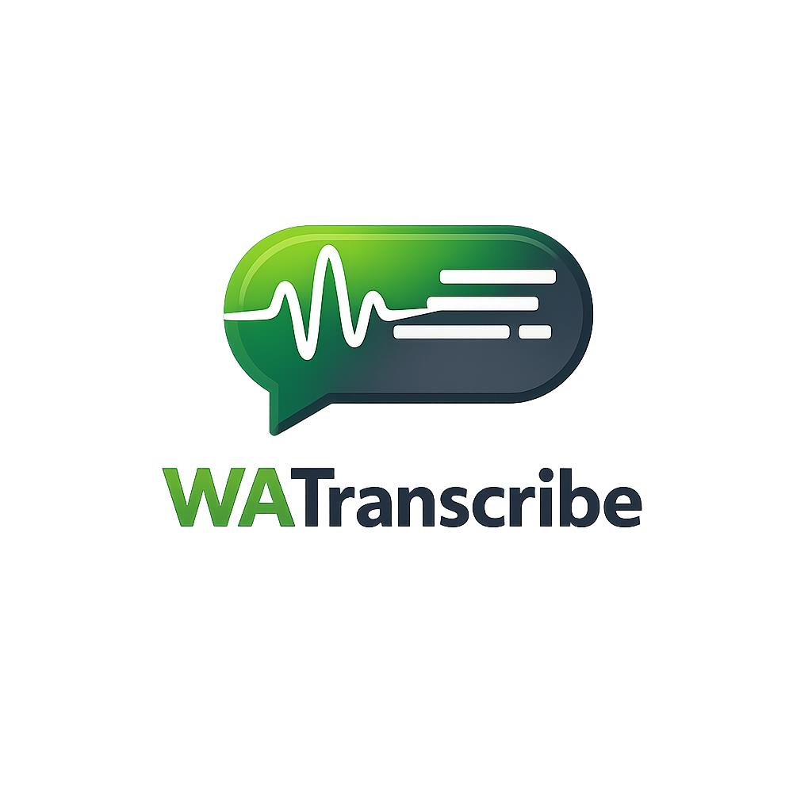

**Transcreva mensagens de voz do WhatsApp Web com Groq ou Whisper local no navegador.**

*Por **Ariel Sousa** — feedbacks, ideias e contribuições são muito bem-vindos.*

---

##  O que é

**WATranscribe** é uma extensão para o Google Chrome que adiciona um botão **Transcrever** nas mensagens de áudio do [WhatsApp Web](https://web.whatsapp.com/). O áudio é obtido via APIs internas do WhatsApp (no contexto da página) e a transcrição roda em um documento **offscreen** com **Whisper** via **WebAssembly** (`@xenova/transformers`).

##  Requisitos

- Google Chrome (ou outro navegador compatível com extensões **Manifest V3**)
- Conta e sessão ativa no **WhatsApp Web**
- Conexão com a internet na **primeira** execução de cada modelo (download e cache dos pesos no navegador)

##  Como instalar (modo desenvolvedor)

1. Abra `chrome://extensions`
2. Ative **Modo do desenvolvedor**
3. Clique em **Carregar sem compactação**
4. Selecione a pasta `extension/` deste repositório

##  Como usar

1. Abra [web.whatsapp.com](https://web.whatsapp.com/)
2. Clique no ícone da extensão e escolha o provedor:
   - **Groq:** cole sua `GROQ_API_KEY` para transcrever com mais velocidade e qualidade
   - **Whisper local:** sem API, com processamento local no navegador
3. Em uma mensagem de voz, use o botão **Transcrever**

##  Privacidade

- No modo **Whisper local**, a transcrição é feita no seu computador (via WASM no Chrome).
- No modo **Groq**, o áudio é enviado para a API da Groq usando a chave informada pelo usuário.

##  Estrutura principal

| Arquivo / pasta | Função |
|------------------|--------|
| `extension/manifest.json` | Manifesto MV3, permissões e ícones |
| `extension/content.js` | UI na página do WhatsApp (mundo isolado) |
| `extension/injected.js` | Acesso ao `window.require` / download de mídia (mundo principal) |
| `extension/background.js` | Service worker e roteamento para o offscreen |
| `extension/offscreen.js` | Carrega Whisper e transcreve |
| `extension/assets/` | Logos e recursos visuais |

##  Feedbacks e contribuições

Este projeto está em evolução. Se algo quebrar após uma atualização do WhatsApp Web, se tiver sugestão de UX ou quiser abrir um PR:

- Abra uma **issue** descrevendo o comportamento esperado vs. atual e, se possível, um print ou passos para reproduzir
- **Pull requests** são bem-vindos (documentação, correções de layout, robustez contra mudanças do DOM, etc.)

## Autoria

**Ariel Sousa** — criador e mantenedor do **WATranscribe**.

---

Obrigado por testar o projeto.

