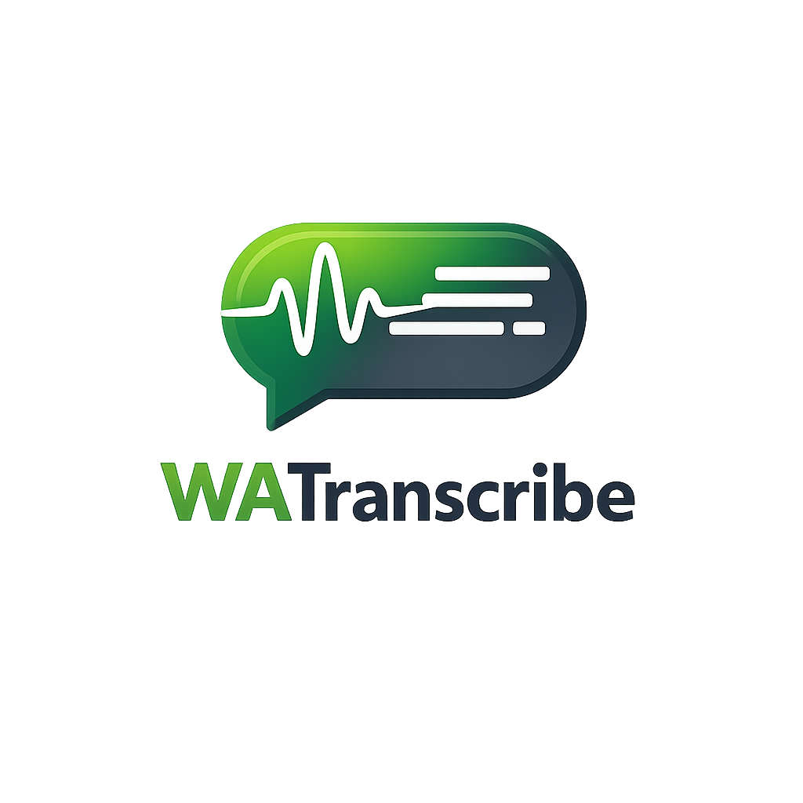

<div align="center">



# WATranscribe

**Seus áudios do WhatsApp, por escrito. Sem login extra, token ou API key.**


[](LICENSE)

Por **Ariel Sousa**

</div>

## Como funciona

A extensão adiciona um botão **Transcrever** abaixo das mensagens de voz no WhatsApp Web. Clique para converter o áudio em texto, com controles para copiar, recolher ou fechar a transcrição.

- Conversas individuais e grupos, para áudios enviados e recebidos.
- Transcrição junto ao balão original, com quebra de linha para textos longos.
- Interface simples, sem configurar servidor ou credenciais.
- Processamento online pelo servidor do projeto e pela Groq, com `whisper-large-v3-turbo` em português.

A versão atual depende de internet e não oferece transcrição local/offline. O projeto usa interfaces internas do WhatsApp, que podem mudar; correções podem ser necessárias após atualizações.

## Instalar

É necessário um navegador Chromium compatível com Manifest V3, como Chrome ou Brave, e uma sessão ativa no WhatsApp Web.

1. Baixe o repositório em **Code → Download ZIP** e extraia, ou clone:

   ```bash
   git clone https://github.com/ArielRSousa/WATranscribe.git
   ```

2. Abra `chrome://extensions` (ou `brave://extensions`).
3. Ative **Modo do desenvolvedor**.
4. Clique em **Carregar sem compactação** e selecione a pasta `extension/`.
5. Abra ou atualize o [WhatsApp Web](https://web.whatsapp.com/).

A instalação documentada aqui é manual; este repositório não fornece um link de publicação na Chrome Web Store.

## Usar

1. Abra uma conversa e encontre uma mensagem de voz.
2. Clique em **Transcrever** abaixo do áudio.
3. Aguarde o texto e use os botões para copiar, recolher ou fechar.

O popup da extensão mostra a disponibilidade do serviço e um atalho para o WhatsApp. Não é preciso criar uma conta no WATranscribe.

**Para atualizar:** substitua os arquivos da extensão, clique em **Recarregar** na página de extensões e atualize as abas do WhatsApp Web.

## Limites e disponibilidade

| Limite | Valor atual |
| --- | --- |
| Tamanho do áudio | Até 3 MB |
| Tentativas por rede/IP | 5 por minuto e 20 por dia |
| Tentativas de todo o serviço | 100 por dia |

Pessoas na mesma rede podem compartilhar a cota. As janelas de uso começam na primeira tentativa e os identificadores de rede são renovados diariamente em UTC. A disponibilidade também depende da Groq, Vercel e Redis. Quando houver limite temporário, aguarde o prazo informado antes de tentar novamente.

## Privacidade

Somente ao clicar em **Transcrever**, o áudio escolhido é enviado ao servidor hospedado na Vercel e à Groq. O código da aplicação não grava áudios nem transcrições em banco de dados. Os provedores têm suas próprias políticas de processamento e registros técnicos.

Para controlar o uso, o servidor mantém contadores temporários no Redis associados a um identificador derivado do IP. As chaves Groq permanecem no servidor, fora da extensão.

Leia a [política de privacidade](https://watranscribe-api.vercel.app/privacy.html).

## Servidor e desenvolvimento

O servidor público está em [watranscribe-api.vercel.app](https://watranscribe-api.vercel.app). Para hospedar sua própria instância, consulte o [guia do servidor](server/README.md) e o [exemplo de variáveis](server/.env.example). O endereço do servidor usado pela extensão é fixo; uma instância própria exige ajustá-lo nos arquivos da extensão e nas permissões do manifesto.

| Pasta / arquivo | Responsabilidade |
| --- | --- |
| `extension/manifest.json` | Manifesto, versão e permissões |
| `extension/content.js` e `styles.css` | Botões e transcrições nas conversas |
| `extension/injected.js` | Localização da mensagem e obtenção do áudio |
| `extension/background.js` e `offscreen.js` | Encaminhamento da transcrição ao servidor |
| `extension/popup.html`, `popup.js` e `popup.css` | Interface da extensão |
| `server/api/` | Disponibilidade e transcrição |
| `server/lib/service.js` | Integração Groq e limites no Redis |
| `server/public/` | Página pública e política de privacidade |
| `tests/` | Testes automatizados com cenários simulados |

Com Node.js 22, execute na raiz:

```bash
node --test tests/*.test.*
```

Os testes cobrem interface, localização de mensagens de grupos, posicionamento dos controles e tratamento de erros da API. São testes com simulações; não substituem a validação de uma transcrição real no WhatsApp.

## Solução de problemas

- **Botão ausente ou layout antigo:** recarregue a extensão e atualize a aba do WhatsApp.
- **Mensagem não encontrada:** atualize para a versão mais recente, reabra a conversa e tente novamente.
- **Serviço indisponível:** tente novamente mais tarde. Na hospedagem própria, confira as variáveis da Vercel e a conexão Redis.
- **Áudio muito grande:** use um áudio de até 3 MB.

## Contribuir

Abra uma [issue](https://github.com/ArielRSousa/WATranscribe/issues) com a versão da extensão, o comportamento observado e os passos para reproduzir. Ao compartilhar capturas, oculte mensagens e dados pessoais. Pull requests são bem-vindos.

Projeto independente, sem vínculo oficial com WhatsApp ou Meta. Licenciado sob a [MIT](LICENSE).
